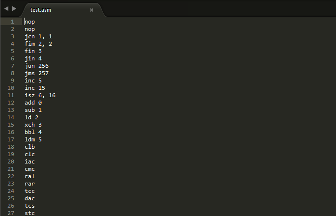
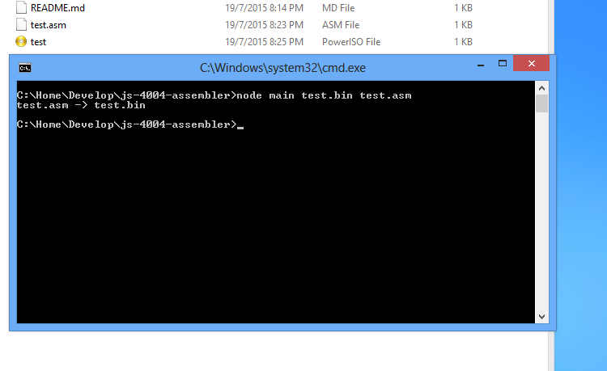
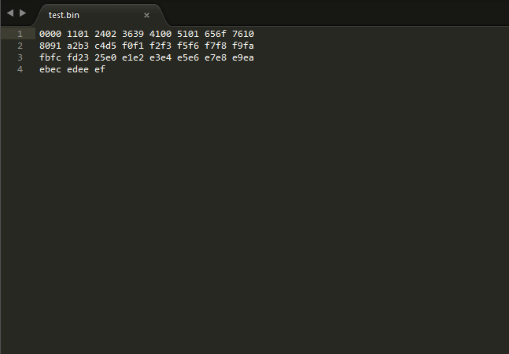

*Assembler* for [Intel 4004 microprocessor](https://en.wikipedia.org/wiki/Intel_4004),
written in *javascript*. Despite being the first *4-bit microprocessor* from
*Intel*, the **4004** has a surprisingly complex *opcodes*. However, the
[opcode table](http://www.intel.com/Assets/PDF/DataSheet/4004_datasheet.pdf)
is simple enough. Also, it is important to mention that this assembler **only**
accepts *numbers* for *registers* and *conditions*, instead of *names* or
*symbols*. It is a **very crude** *assembler*.
 
 

 
The source file `test.asm` with **4004** instructions.
  

 
Run assembler as `node main <destination> <source>`. 
Here it is `node main test.bin test.asm`.
  

 
`test.asm` is converted into `test.bin`.
  

 
`test.bin` contains *machine code* for **4004**.
  
